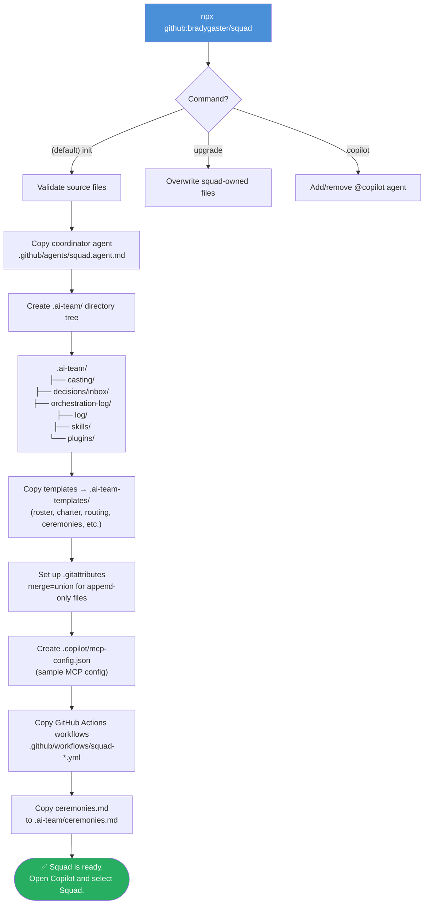
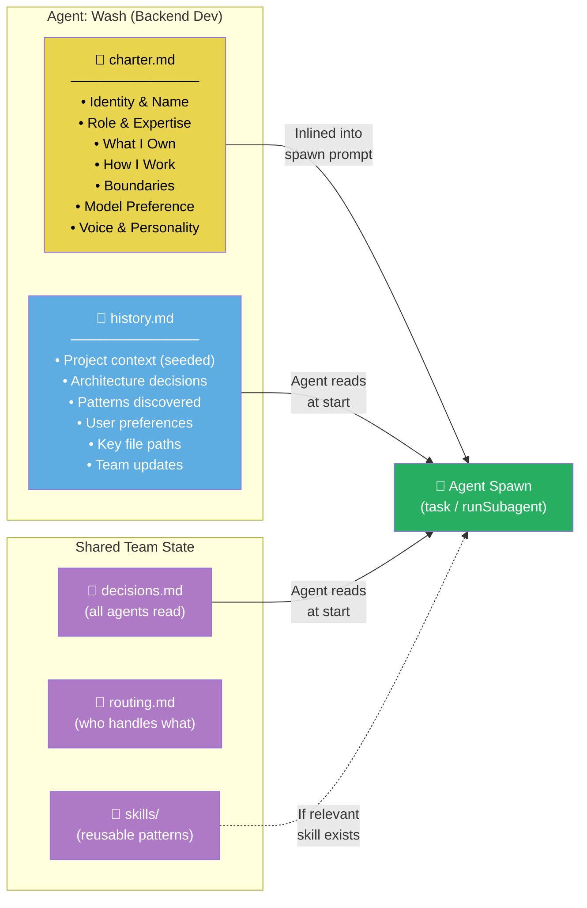
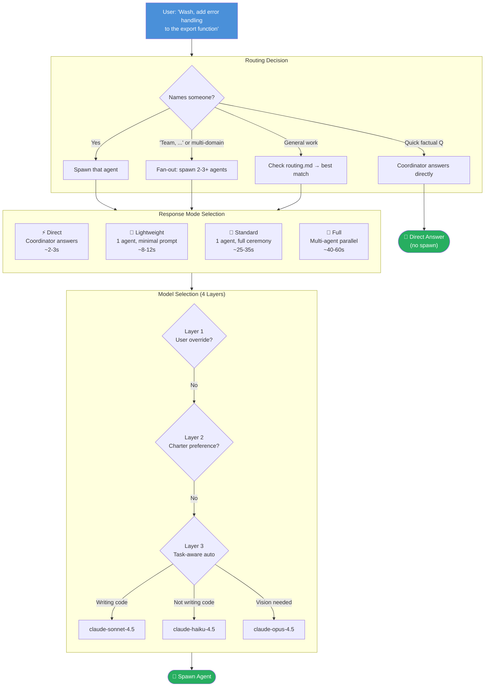
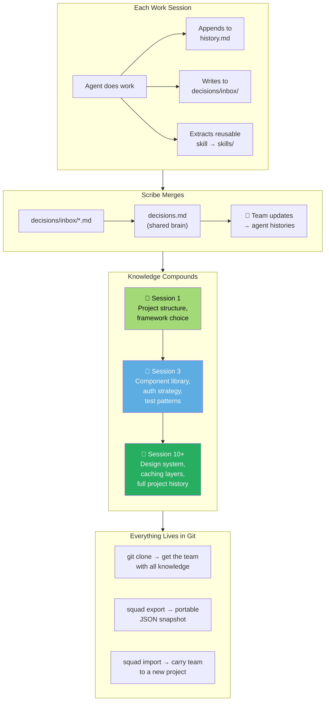
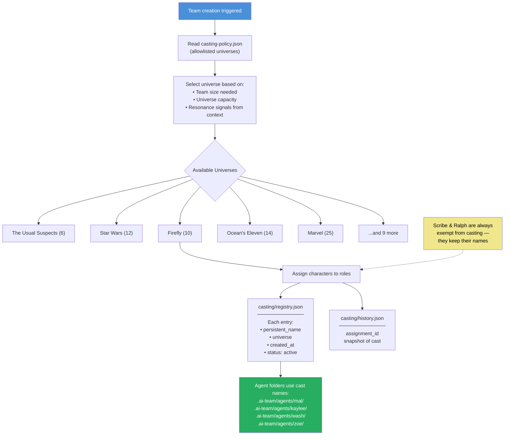
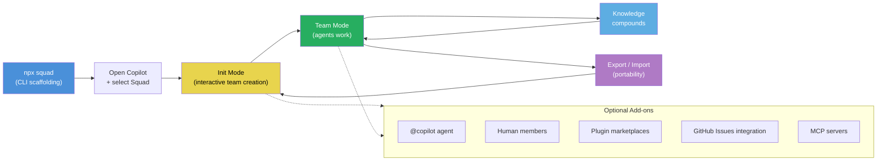

# Squad Team Creation Flow

Visual diagrams illustrating how Squad creates, initializes, and operates an AI agent team.

---

## Phase 1 — CLI Scaffolding

When you run `npx github:bradygaster/squad`, the CLI sets up the project infrastructure. No team members exist yet — only the skeleton.

---

## Phase 2 — Init Mode: The Coordinator Builds the Team

On first Copilot session, the coordinator detects no `team.md` and enters Init Mode — an interactive conversation that produces the full team.

```mermaid
sequenceDiagram
    actor User
    participant Coord as Squad Coordinator<br/>(squad.agent.md)
    participant FS as File System<br/>(.ai-team/)
    participant Git as Git Config

    User->>Coord: Opens Copilot, selects Squad agent

    Note over Coord,FS: Coordinator checks: does .ai-team/team.md exist?<br/>❌ No → Init Mode

    Coord->>Git: git config user.name / user.email
    Git-->>Coord: "Brady" / brady@example.com

    Coord->>User: "Hey Brady, what are you building?"
    User->>Coord: "A recipe sharing app with React and Node"

    Note over Coord: 🔍 Ask Classification

    rect rgb(78, 63, 89)
        Note over Coord: Classify the Ask
        Coord->>Coord: Analyze user description for ask type
        alt Executive / Strategic
            Note over Coord: Vague scope, business outcomes,<br/>no stack specified
            Coord->>Coord: Auto-include: Researcher + Design Strategist
            Coord->>Coord: Enable: Synthetic SME spawning
            Coord->>Coord: Team size: 5-7 + Scribe + Ralph
        else Exploratory / Research
            Note over Coord: "Investigate", "compare",<br/>"spike", "proof of concept"
            Coord->>Coord: Auto-include: Researcher
            Coord->>Coord: Suggest: Design Strategist (if user-facing)
            Coord->>Coord: Team size: 5-6 + Scribe + Ralph
        else Technical / Implementation
            Note over Coord: Specific stack, clear deliverable,<br/>PRD provided
            Coord->>Coord: Standard team composition
            Coord->>Coord: Team size: 4-5 + Scribe + Ralph
        end
    end

    Note over Coord: 🎭 Casting Algorithm begins

    rect rgb(59, 63, 79)
        Note over Coord: Casting & Persistent Naming
        Coord->>Coord: Determine team size (adjusted by ask type)
        Coord->>Coord: Derive assignment shape from project description
        Coord->>Coord: Select thematic universe<br/>(e.g., "Firefly")
        Coord->>Coord: Allocate character names to roles
    end

    Coord->>User: Proposed team:<br/>🏗️ Mal — Lead<br/>⚛️ Kaylee — Frontend Dev<br/>🔧 Wash — Backend Dev<br/>🧪 Zoe — Tester<br/>📋 Scribe — (silent)<br/>🔄 Ralph — (monitor)

    Note over Coord: For Executive/Exploratory asks, also includes:<br/>🔍 Book — Researcher<br/>🎨 Inara — Design Strategist

    User->>Coord: "Yes"

    Note over Coord,FS: ✅ Confirmation → Create all team state

    par Create team files in parallel
        Coord->>FS: Write team.md (roster)
        Coord->>FS: Write routing.md (work routing table)
        Coord->>FS: Write casting/registry.json
        Coord->>FS: Write casting/policy.json
        Coord->>FS: Write casting/history.json
    end

    loop For each agent (Mal, Kaylee, Wash, Zoe, Scribe)
        Coord->>FS: Create agents/{name}/charter.md<br/>(identity, expertise, boundaries, voice)
        Coord->>FS: Create agents/{name}/history.md<br/>(seeded with project context)
    end

    opt Executive / Exploratory ask detected
        Note over Coord,FS: Enrich discovery persona charters
        Coord->>FS: Append "## SME Coordination" to<br/>Researcher's charter.md
        Coord->>FS: Append "## SME Interview Protocol" to<br/>Designer's charter.md
        Coord->>FS: Add discovery routing entries to routing.md<br/>(Research & evaluation, UX & user journey, SME interviews)
    end

    Coord->>FS: Write decisions.md (empty)
    Coord->>FS: Ensure decisions/inbox/ exists

    Coord->>User: "✅ Team hired.<br/>Try: 'Mal, set up the project structure'"
```

---

## Phase 3 — What Makes Up an Agent

Each agent is defined entirely by markdown files — no code. The coordinator inlines these into spawn prompts at runtime.

---

## Phase 4 — Routing & Model Selection

When a user gives a task, the coordinator decides **WHO** handles it (routing) and **HOW** (response mode), then selects the optimal model.

---

## Phase 5 — Parallel Execution & Drop-Box Pattern

For multi-agent tasks, the coordinator spawns all independent agents simultaneously. Shared state uses a drop-box pattern to avoid file conflicts.

```mermaid
sequenceDiagram
    actor User
    participant Coord as Coordinator
    participant Lead as 🏗️ Mal<br/>(Lead)
    participant FE as ⚛️ Kaylee<br/>(Frontend)
    participant BE as 🔧 Wash<br/>(Backend)
    participant Test as 🧪 Zoe<br/>(Tester)
    participant Scribe as 📋 Scribe
    participant FS as .ai-team/

    User->>Coord: "Team, build the login page"

    Note over Coord: Decompose → 4 agents can start now

    Coord->>User: 🏗️ Mal — analyzing requirements<br/>⚛️ Kaylee — building login form<br/>🔧 Wash — setting up auth endpoints<br/>🧪 Zoe — writing test cases from spec

    par All spawned as background in one turn
        Coord->>Lead: Spawn (background)
        Coord->>FE: Spawn (background)
        Coord->>BE: Spawn (background)
        Coord->>Test: Spawn (background)
    end

    par Agents work independently
        Lead->>FS: Write decisions/inbox/mal-login-arch.md
        Lead->>FS: Append to agents/mal/history.md
        FE->>FS: Create src/components/Login.tsx
        FE->>FS: Write decisions/inbox/kaylee-form-lib.md
        BE->>FS: Create src/routes/auth.ts
        BE->>FS: Write decisions/inbox/wash-jwt-strategy.md
        Test->>FS: Create tests/login.test.ts
        Test->>FS: Append to agents/zoe/history.md
    end

    Coord->>Coord: Collect all results (read_agent)

    Coord->>User: Results:<br/>⚛️ Kaylee — Built login form<br/>🔧 Wash — Created auth endpoint<br/>🧪 Zoe — Wrote 12 test cases

    Note over Coord: Check decisions/inbox/ → files exist → spawn Scribe

    Coord->>Scribe: Spawn (background, never wait)

    rect rgb(59, 63, 79)
        Note over Scribe,FS: Scribe works silently
        Scribe->>FS: Merge inbox → decisions.md
        Scribe->>FS: Delete inbox files
        Scribe->>FS: Deduplicate decisions
        Scribe->>FS: Propagate updates to agent histories
        Scribe->>FS: Write session log
        Scribe->>FS: git add .ai-team/ && git commit
    end

    Note over Coord: Assess: do results unblock more work?
    Coord->>BE: Spawn (follow-up: edge cases from Zoe's tests)
```

---

## Phase 6 — Knowledge Accumulation Over Time

Every session adds to each agent's knowledge. The team gets smarter with use.

---

## Phase 7 — Casting & Persistent Naming

The casting system gives agents memorable, thematic names from pop-culture universes rather than generic role labels.

---

## Full Lifecycle — End to End

