# Squad Team Creation Flow

Visual diagrams illustrating how Squad creates, initializes, and operates an AI agent team.

---

## Phase 1 — CLI Scaffolding

When you run `npx github:bradygaster/squad`, the CLI sets up the project infrastructure. No team members exist yet — only the skeleton.

```mermaid
flowchart TD
    A["npx github:bradygaster/squad"] --> B{Command?}

    B -->|"(default) init"| C["Validate source files"]
    B -->|upgrade| U["Overwrite squad-owned files"]
    B -->|copilot| CO["Add/remove @copilot agent"]

    C --> D["Copy coordinator agent\n.github/agents/squad.agent.md"]
    D --> E["Create .ai-team/ directory tree"]

    E --> F[".ai-team/\n├── casting/\n├── decisions/inbox/\n├── orchestration-log/\n├── log/\n├── skills/\n└── plugins/"]

    F --> G["Copy templates → .ai-team-templates/\n(roster, charter, routing, ceremonies, etc.)"]
    G --> H["Set up .gitattributes\nmerge=union for append-only files"]
    H --> I["Create .copilot/mcp-config.json\n(sample MCP config)"]
    I --> J["Copy GitHub Actions workflows\n.github/workflows/squad-*.yml"]
    J --> K["Copy ceremonies.md\nto .ai-team/ceremonies.md"]

    K --> L(["✅ Squad is ready.\nOpen Copilot and select Squad."])

    style A fill:#4a90d9,color:#fff
    style L fill:#27ae60,color:#fff
```

---

## Phase 2 — Init Mode: The Coordinator Builds the Team

On first Copilot session, the coordinator detects no `team.md` and enters Init Mode — an interactive conversation that produces the full team.

```mermaid
sequenceDiagram
    actor User
    participant Coord as Squad Coordinator<br/>(squad.agent.md)
    participant FS as File System<br/>(.ai-team/)
    participant Git as Git Config

    User->>Coord: Opens Copilot, selects Squad agent

    Note over Coord,FS: Coordinator checks: does .ai-team/team.md exist?<br/>❌ No → Init Mode

    Coord->>Git: git config user.name / user.email
    Git-->>Coord: "Brady" / brady@example.com

    Coord->>User: "Hey Brady, what are you building?"
    User->>Coord: "A recipe sharing app with React and Node"

    Note over Coord: 🔍 Ask Classification

    rect rgb(78, 63, 89)
        Note over Coord: Classify the Ask
        Coord->>Coord: Analyze user description for ask type
        alt Executive / Strategic
            Note over Coord: Vague scope, business outcomes,<br/>no stack specified
            Coord->>Coord: Auto-include: Researcher + Design Strategist
            Coord->>Coord: Enable: Synthetic SME spawning
            Coord->>Coord: Team size: 5-7 + Scribe + Ralph
        else Exploratory / Research
            Note over Coord: "Investigate", "compare",<br/>"spike", "proof of concept"
            Coord->>Coord: Auto-include: Researcher
            Coord->>Coord: Suggest: Design Strategist (if user-facing)
            Coord->>Coord: Team size: 5-6 + Scribe + Ralph
        else Technical / Implementation
            Note over Coord: Specific stack, clear deliverable,<br/>PRD provided
            Coord->>Coord: Standard team composition
            Coord->>Coord: Team size: 4-5 + Scribe + Ralph
        end
    end

    Note over Coord: 🎭 Casting Algorithm begins

    rect rgb(59, 63, 79)
        Note over Coord: Casting & Persistent Naming
        Coord->>Coord: Determine team size (adjusted by ask type)
        Coord->>Coord: Derive assignment shape from project description
        Coord->>Coord: Select thematic universe<br/>(e.g., "Firefly")
        Coord->>Coord: Allocate character names to roles
    end

    Coord->>User: Proposed team:<br/>🏗️ Mal — Lead<br/>⚛️ Kaylee — Frontend Dev<br/>🔧 Wash — Backend Dev<br/>🧪 Zoe — Tester<br/>📋 Scribe — (silent)<br/>🔄 Ralph — (monitor)

    Note over Coord: For Executive/Exploratory asks, also includes:<br/>🔍 Book — Researcher<br/>🎨 Inara — Design Strategist

    User->>Coord: "Yes"

    Note over Coord,FS: ✅ Confirmation → Create all team state

    par Create team files in parallel
        Coord->>FS: Write team.md (roster)
        Coord->>FS: Write routing.md (work routing table)
        Coord->>FS: Write casting/registry.json
        Coord->>FS: Write casting/policy.json
        Coord->>FS: Write casting/history.json
    end

    loop For each agent (Mal, Kaylee, Wash, Zoe, Scribe)
        Coord->>FS: Create agents/{name}/charter.md<br/>(identity, expertise, boundaries, voice)
        Coord->>FS: Create agents/{name}/history.md<br/>(seeded with project context)
    end

    opt Executive / Exploratory ask detected
        Note over Coord,FS: Enrich discovery persona charters
        Coord->>FS: Append "## SME Coordination" to<br/>Researcher's charter.md
        Coord->>FS: Append "## SME Interview Protocol" to<br/>Designer's charter.md
        Coord->>FS: Add discovery routing entries to routing.md<br/>(Research & evaluation, UX & user journey, SME interviews)
    end

    Coord->>FS: Write decisions.md (empty)
    Coord->>FS: Ensure decisions/inbox/ exists

    Coord->>User: "✅ Team hired.<br/>Try: 'Mal, set up the project structure'"
```

---

## Phase 3 — What Makes Up an Agent

Each agent is defined entirely by markdown files — no code. The coordinator inlines these into spawn prompts at runtime.

```mermaid
flowchart LR
    subgraph Agent["Agent: Wash (Backend Dev)"]
        direction TB
        Charter["📄 charter.md\n─────────────\n• Identity & Name\n• Role & Expertise\n• What I Own\n• How I Work\n• Boundaries\n• Model Preference\n• Voice & Personality"]
        History["📄 history.md\n─────────────\n• Project context (seeded)\n• Architecture decisions\n• Patterns discovered\n• User preferences\n• Key file paths\n• Team updates"]
    end

    subgraph Team["Shared Team State"]
        direction TB
        Decisions["📄 decisions.md\n(all agents read)"]
        Routing["📄 routing.md\n(who handles what)"]
        Skills["📂 skills/\n(reusable patterns)"]
    end

    Charter --> |"Inlined into\nspawn prompt"| Spawn["🚀 Agent Spawn\n(task / runSubagent)"]
    History --> |"Agent reads\nat start"| Spawn
    Decisions --> |"Agent reads\nat start"| Spawn
    Skills -.-> |"If relevant\nskill exists"| Spawn

    style Charter fill:#e8d44d,color:#000
    style History fill:#5dade2,color:#fff
    style Decisions fill:#af7ac5,color:#fff
    style Routing fill:#af7ac5,color:#fff
    style Skills fill:#af7ac5,color:#fff
    style Spawn fill:#27ae60,color:#fff
```

---

## Phase 4 — Routing & Model Selection

When a user gives a task, the coordinator decides **WHO** handles it (routing) and **HOW** (response mode), then selects the optimal model.

```mermaid
flowchart TD
    Input["User: 'Wash, add error handling\nto the export function'"] --> Route

    subgraph Route["Routing Decision"]
        R1{"Names someone?"}
        R1 -->|Yes| R2["Spawn that agent"]
        R1 -->|"'Team, ...' or multi-domain"| R3["Fan-out: spawn 2-3+ agents"]
        R1 -->|"Quick factual Q"| R4["Coordinator answers directly"]
        R1 -->|"General work"| R5["Check routing.md → best match"]
    end

    R2 --> Mode
    R3 --> Mode
    R5 --> Mode

    subgraph Mode["Response Mode Selection"]
        direction TB
        M1["⚡ Direct\nCoordinator answers\n~2-3s"]
        M2["🔹 Lightweight\n1 agent, minimal prompt\n~8-12s"]
        M3["🔷 Standard\n1 agent, full ceremony\n~25-35s"]
        M4["🔶 Full\nMulti-agent parallel\n~40-60s"]
    end

    Mode --> Model

    subgraph Model["Model Selection (4 Layers)"]
        direction TB
        L1{"Layer 1\nUser override?"} -->|No| L2
        L2{"Layer 2\nCharter preference?"} -->|No| L3
        L3{"Layer 3\nTask-aware auto"}
        L3 -->|"Writing code"| S["claude-sonnet-4.5"]
        L3 -->|"Not writing code"| H["claude-haiku-4.5"]
        L3 -->|"Vision needed"| O["claude-opus-4.5"]
    end

    Model --> Spawn(["🚀 Spawn Agent"])

    R4 --> Direct(["💬 Direct Answer\n(no spawn)"])

    style Input fill:#4a90d9,color:#fff
    style Spawn fill:#27ae60,color:#fff
    style Direct fill:#27ae60,color:#fff
```

---

## Phase 5 — Parallel Execution & Drop-Box Pattern

For multi-agent tasks, the coordinator spawns all independent agents simultaneously. Shared state uses a drop-box pattern to avoid file conflicts.

```mermaid
sequenceDiagram
    actor User
    participant Coord as Coordinator
    participant Lead as 🏗️ Mal<br/>(Lead)
    participant FE as ⚛️ Kaylee<br/>(Frontend)
    participant BE as 🔧 Wash<br/>(Backend)
    participant Test as 🧪 Zoe<br/>(Tester)
    participant Scribe as 📋 Scribe
    participant FS as .ai-team/

    User->>Coord: "Team, build the login page"

    Note over Coord: Decompose → 4 agents can start now

    Coord->>User: 🏗️ Mal — analyzing requirements<br/>⚛️ Kaylee — building login form<br/>🔧 Wash — setting up auth endpoints<br/>🧪 Zoe — writing test cases from spec

    par All spawned as background in one turn
        Coord->>Lead: Spawn (background)
        Coord->>FE: Spawn (background)
        Coord->>BE: Spawn (background)
        Coord->>Test: Spawn (background)
    end

    par Agents work independently
        Lead->>FS: Write decisions/inbox/mal-login-arch.md
        Lead->>FS: Append to agents/mal/history.md
        FE->>FS: Create src/components/Login.tsx
        FE->>FS: Write decisions/inbox/kaylee-form-lib.md
        BE->>FS: Create src/routes/auth.ts
        BE->>FS: Write decisions/inbox/wash-jwt-strategy.md
        Test->>FS: Create tests/login.test.ts
        Test->>FS: Append to agents/zoe/history.md
    end

    Coord->>Coord: Collect all results (read_agent)

    Coord->>User: Results:<br/>⚛️ Kaylee — Built login form<br/>🔧 Wash — Created auth endpoint<br/>🧪 Zoe — Wrote 12 test cases

    Note over Coord: Check decisions/inbox/ → files exist → spawn Scribe

    Coord->>Scribe: Spawn (background, never wait)

    rect rgb(59, 63, 79)
        Note over Scribe,FS: Scribe works silently
        Scribe->>FS: Merge inbox → decisions.md
        Scribe->>FS: Delete inbox files
        Scribe->>FS: Deduplicate decisions
        Scribe->>FS: Propagate updates to agent histories
        Scribe->>FS: Write session log
        Scribe->>FS: git add .ai-team/ && git commit
    end

    Note over Coord: Assess: do results unblock more work?
    Coord->>BE: Spawn (follow-up: edge cases from Zoe's tests)
```

---

## Phase 6 — Knowledge Accumulation Over Time

Every session adds to each agent's knowledge. The team gets smarter with use.

```mermaid
flowchart TB
    subgraph Session["Each Work Session"]
        direction LR
        Work["Agent does work"] --> Learn["Appends to\nhistory.md"]
        Work --> Decide["Writes to\ndecisions/inbox/"]
        Work --> Skill["Extracts reusable\nskill → skills/"]
    end

    subgraph Merge["Scribe Merges"]
        direction LR
        Inbox["decisions/inbox/*.md"] --> Canonical["decisions.md\n(shared brain)"]
        Canonical --> Propagate["📌 Team updates\n→ agent histories"]
    end

    subgraph Growth["Knowledge Compounds"]
        direction TB
        S1["🌱 Session 1\nProject structure,\nframework choice"]
        S2["🌿 Session 3\nComponent library,\nauth strategy,\ntest patterns"]
        S3["🌳 Session 10+\nDesign system,\ncaching layers,\nfull project history"]
        S1 --> S2 --> S3
    end

    Session --> Merge --> Growth

    subgraph Portability["Everything Lives in Git"]
        direction LR
        Clone["git clone → get the team\nwith all knowledge"]
        Export["squad export → portable\nJSON snapshot"]
        Import["squad import → carry team\nto a new project"]
    end

    Growth --> Portability

    style S1 fill:#a3d977,color:#000
    style S2 fill:#5dade2,color:#fff
    style S3 fill:#27ae60,color:#fff
```

---

## Phase 7 — Casting & Persistent Naming

The casting system gives agents memorable, thematic names from pop-culture universes rather than generic role labels.

```mermaid
flowchart TD
    Start["Team creation triggered"] --> Policy["Read casting-policy.json\n(allowlisted universes)"]

    Policy --> Select["Select universe based on:\n• Team size needed\n• Universe capacity\n• Resonance signals from context"]

    Select --> Universes{"Available Universes"}
    Universes --> U1["The Usual Suspects (6)"]
    Universes --> U2["Star Wars (12)"]
    Universes --> U3["Firefly (10)"]
    Universes --> U4["Ocean's Eleven (14)"]
    Universes --> U5["Marvel (25)"]
    Universes --> U6["...and 9 more"]

    U3 --> Assign["Assign characters to roles"]

    Assign --> Registry["casting/registry.json\n─────────────\nEach entry:\n• persistent_name\n• universe\n• created_at\n• status: active"]

    Assign --> History["casting/history.json\n─────────────\nassignment_id\nsnapshot of cast"]

    Registry --> Names["Agent folders use cast names:\n.ai-team/agents/mal/\n.ai-team/agents/kaylee/\n.ai-team/agents/wash/\n.ai-team/agents/zoe/"]

    Note1["Scribe & Ralph are always\nexempt from casting —\nthey keep their names"] -.-> Assign

    style Start fill:#4a90d9,color:#fff
    style Names fill:#27ae60,color:#fff
    style Note1 fill:#f0e68c,color:#000
```

---

## Full Lifecycle — End to End

